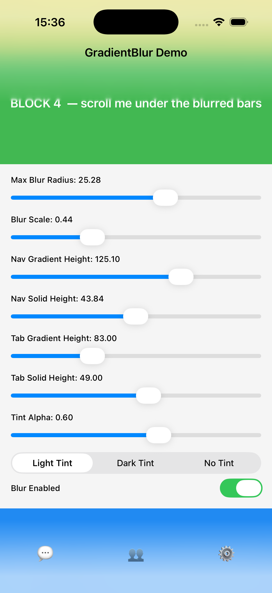
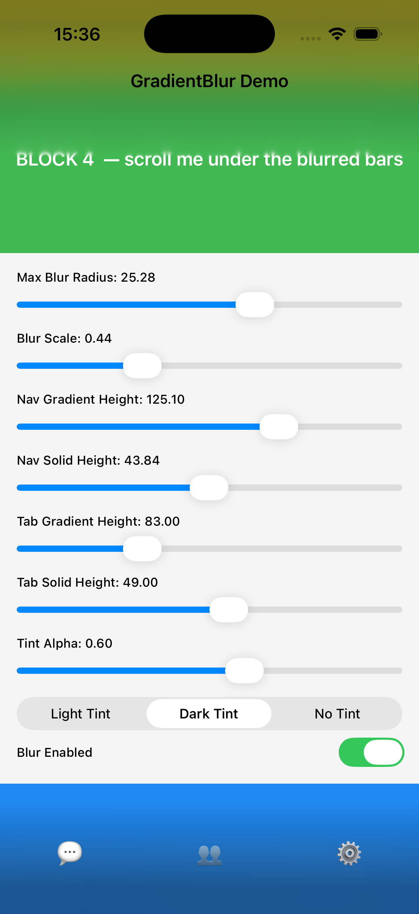
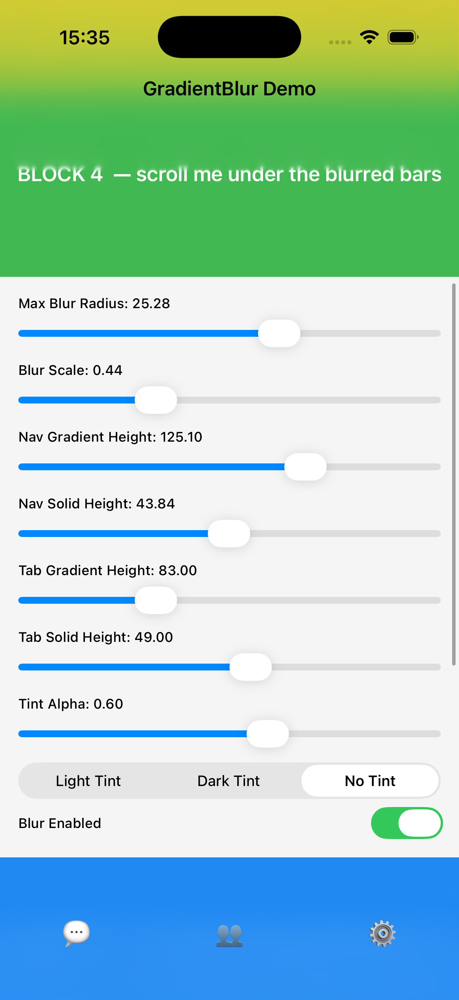

# GradientBlur

iOS 上"沿轴向渐变的高斯模糊"视图组件。导航栏下拉渐隐、TabBar 上浮渐显、卡片边缘柔化、照片浏览器边缘退底 —— 都可以一个 `GradientBlurView` 搞定。

<p align="center">
  
  
  
  
</p>

## 特性

- **真·变量高斯模糊**：沿 Y 轴预设非线性曲线（256 点）平滑过渡，一端完全清晰 → 另一端完全透明
- **双路径自动切换**：iOS 26+ 走 `inputSourceSublayerName` 新路径（更新 mask 免重建 filter），iOS 15–18 自动走 legacy `inputMaskImage` 路径
- **色调层（Tint）独立可控**：颜色、alpha、过渡动画三者分离，换色零重绘（模板图 + `tintColor`）
- **零外部依赖**：单 SwiftPM target、纯 Swift、无 OC 桥接头
- **私有 API 混淆**：`CAFilter` / `CABackdropLayer` / `filterWithName:` / `inputRadius` 等关键字全部 base64 混淆，降低静态扫描命中风险
- **iOS 15+** 起全版本可用

## 效果预览

顶部 `.topToBottom`、底部 `.bottomToTop` 同一组几何参数（`constantHeight` / `startOffset` / `maxBlurRadius`），在不同 tint 档位下的表现：

<table>
  <tr>
    <th align="center">Light Tint</th>
    <th align="center">Dark Tint</th>
    <th align="center">No Tint</th>
  </tr>
  <tr>
    <td></td>
    <td></td>
    <td></td>
  </tr>
  <tr>
    <td align="center">白色半透 tint，经典导航栏风格</td>
    <td align="center">黑色半透 tint，深色主题</td>
    <td align="center">纯模糊无 tint，背景直接穿透</td>
  </tr>
</table>

## 安装

### Swift Package Manager

在 `Package.swift` 中添加：

```swift
dependencies: [
    .package(url: "https://github.com/sunimp/GradientBlur.git", from: "0.1.0"),
]
```

然后在 target 里声明依赖：

```swift
.target(name: "YourTarget", dependencies: ["GradientBlur"])
```

或在 Xcode 里：**File → Add Package Dependencies…** → 粘仓库 URL。

## 基本用法

```swift
import GradientBlur

let blurView = GradientBlurView(direction: .topToBottom)
blurView.updateTint(color: UIColor.systemBackground, alpha: 0.6)
view.addSubview(blurView)

// 布局完成后
blurView.frame = CGRect(x: 0, y: 0, width: view.bounds.width, height: 113)
blurView.update(
    size: blurView.bounds.size,
    constantHeight: 88, // 完整渐变段长度
    startOffset: 44     // 其中开头 44pt 纯不透明
)
```

## 常见场景

### 导航栏向下扩散

```swift
let topBlur = GradientBlurView(direction: .topToBottom)
topBlur.updateTint(color: .systemBackground, alpha: 0.6)

// 布局时
let insets = view.safeAreaInsets
topBlur.frame = CGRect(
    x: 0, y: 0,
    width: view.bounds.width,
    height: insets.top + 44 + 25 // 安全区 + 导航栏 + 延伸过渡段
)
topBlur.update(
    size: topBlur.bounds.size,
    constantHeight: insets.top + 44,
    startOffset: insets.top + 44 // 整个导航栏区实心、延伸段渐变
)
```

### TabBar 向上扩散

```swift
let bottomBlur = GradientBlurView(direction: .bottomToTop)
bottomBlur.updateTint(color: .systemBackground, alpha: 0.6)

let tabBarHeight: CGFloat = 49
let totalHeight = view.safeAreaInsets.bottom + tabBarHeight + 25
bottomBlur.frame = CGRect(
    x: 0, y: view.bounds.height - totalHeight,
    width: view.bounds.width, height: totalHeight
)
bottomBlur.update(
    size: bottomBlur.bounds.size,
    constantHeight: view.safeAreaInsets.bottom + tabBarHeight,
    startOffset: view.safeAreaInsets.bottom + tabBarHeight
)
```

### 跟随滚动淡入

```swift
func scrollViewDidScroll(_ scrollView: UIScrollView) {
    let alpha = min(1, max(0, scrollView.contentOffset.y / 60))
    topBlur.updateTint(color: .systemBackground, alpha: alpha, transition: .immediate)
}
```

## Public API

```swift
public final class GradientBlurView: UIView {
    public enum GradientDirection { case topToBottom, bottomToTop }

    public init(
        direction: GradientDirection,
        maxBlurRadius: CGFloat = 20.0,
        blurScale: CGFloat = 0.5,
        isTransparent: Bool = false
    )

    public func update(
        size: CGSize,
        constantHeight: CGFloat,
        startOffset: CGFloat = 0.0,
        transition: BlurTransition = .immediate
    )

    public func updateTint(
        color: UIColor?,
        alpha: CGFloat = 1.0,
        transition: BlurTransition = .immediate
    )

    public func updateBlurRadius(_ radius: CGFloat)
    public func updateBlurScale(_ scale: CGFloat)
    public func setBlurEnabled(_ enabled: Bool)
}

public enum BlurTransition: Sendable {
    case immediate
    case animated(duration: TimeInterval, curve: UIView.AnimationCurve)
    public static let defaultAnimated: BlurTransition
}
```

### 参数语义

| 参数 | 含义 |
|---|---|
| `direction` | 渐变方向；`.topToBottom` 顶部不透明、`.bottomToTop` 底部不透明 |
| `maxBlurRadius` | 最大模糊半径（在不透明侧达到的实际高斯半径） |
| `blurScale` | backdrop 栅格化缩放（0.2–1.0）。**纯性能参数**：越小越省 GPU、过小会有栅格化伪影；默认 0.5 通常最优 |
| `isTransparent` | 宿主自身透明（如浮在图片上）时设 `true`，避免边缘出现硬裁 |
| `size` | 视图总尺寸 |
| `constantHeight` | 从不透明一侧起算的渐变段总长度（**含**可选的实心段） |
| `startOffset` | 不透明一侧保留的纯实心段长度 |

**常见混淆**：`blurScale` 不是"模糊范围"，模糊范围由 `constantHeight` / `startOffset` 控制；`blurScale` 只决定采样精细度。

## 运行 Demo

```bash
cd Example
xcodegen generate
open GradientBlurDemo.xcodeproj
```

Demo 提供 7 个滑块实时调 `maxBlurRadius` / `blurScale` / `constantHeight` / `startOffset` / tint alpha，便于直观理解各参数效果。

## 私有 API 风险声明

**本组件依赖 Apple 私有 API**：

- `CAFilter`（`variableBlur` 滤镜）
- `CABackdropLayer`（通过反射创建）
- 若干 KVC 输入键（`inputRadius` / `inputMaskImage` / `inputSourceSublayerName` 等）

已采取的风险缓解措施：

1. 全部私有类名、selector、filter 名、KVC 键通过 **base64 运行时解码**，源码与二进制中不出现这些字面量
2. 类查找结果缓存复用，避免热路径重复反射
3. Fallback 友好：任何私有 API 返回 `nil` 时组件静默降级（不崩溃，只是没有模糊效果）

**但仍无法保证通过 App Store 审核**。本项目在中国大陆主流 App 的大量公开二进制中有类似技术（包括 Telegram、Midnight、多家知名社交 App 的毛玻璃导航栏），目前没有大规模被拒案例，但 Apple 政策可能随时变化。

**上架前请自行做好评估**：
- 最低限度：在 App Store Connect 的 TestFlight 内部测试渠道先试一轮
- 更稳妥：在关键二进制处做二次混淆，或提供编译开关在 `#if APPSTORE` 场景下降级为 `UIBlurEffect`

本库遵循 MIT，使用本库产生的一切风险由使用者自行承担。

## 支持的系统

| iOS 版本 | 行为 |
|---|---|
| iOS 15.0 – 18.x | Legacy 路径（`inputMaskImage`）。蒙版尺寸变化需重绘整张 mask 图 |
| iOS 26.0+ | 新路径（`inputSourceSublayerName`）。蒙版尺寸变化只需改子 layer `contents`，更省 |

## 贡献

欢迎 Issue / PR。详情见 [CONTRIBUTING.md](CONTRIBUTING.md)。

## License

[MIT](LICENSE) © Sun

## 致谢

- Janum Trivedi 的 [VariableBlurView](https://github.com/jtrivedi/VariableBlurView) 首次公开了 `CAFilter("variableBlur")` 的 KVC 接入方式
- A. Zheng 的 [过审安全版本](https://github.com/aheze/VariableBlurView) 示范了 base64 混淆思路

本项目在私有 API 接入与 iOS 26+ 新路径上做了独立实现，功能面和性能对齐生产级方案。
